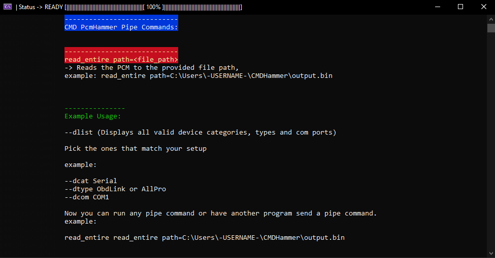

## Overview

This is a more bare bones "command-line / API wrapper" version of PcmHammer, should be helpful for anyone wanting to write a program ontop of it without modifying PcmHammer's code directly

These tools currently support reading, writing, and data logging with some General Motors PCM's: P01, P04, P08, P10, P12, P59, 4 connector 98-02 Black Box and E54.
## Note: This is work in progress unstable build until stated otherwise and may contain bugs that the original PCM Hammer doesn't have.

## Download CMD PcmHammer

Bare bones PcmHammer CMD version: https://github.com/ToxicHax/PcmHammerCMD/releases

The most recent release will be at the top of that page once available.
Click "Assets" (below the description of the release) and download the .zip file.   
Extract the contents of the zip file, and you can access PcmHammerCMD.exe through a command line.

(ignore the double 'read_entire' under the example.. shhhh, i may have overlooked that)

## API Wrapper? Library?

Not yet.
The mentioned CMD PcmHammer Library will probably have a seperate GitHub since its not an actual library that requires PcmHammer code, its more of a standalone wrapper that uses pipe messages to send and interact with this PcmHammer CMD program.
once its available the GitHub and source for the DLL will be posted below.
For now im focusing on like 1 project at a time.

## Links

[PcmHamer CMD Wiki](https://github.com/ToxicHax/PcmHammerCMD/wiki)

[Original PcmHammer GitHub Page](https://github.com/PcmHammer/PcmHammer)

##

## What purpose does the 'command-line / API wrapper' version of PcmHammer serve?

The general purpose is not to make your life more difficult, this tool will be less about manually type commands into a CMD version, 
but rather to provide a way for a program to send commands to PcmHammerCMD without the user having to manually go through the original UI version.

Why?

I personally have a project in the works thats essentially a free .bin editing / tuning software, similar to other tuning software you've seen from companies like HPTuners, Holley...etc just without the locked down nature of their programs.
Similar to TunerPro, just with a fancy UI and features that some tuners might really appreciate to help improve their workflow.

I work daily with HPTuners and I've tuned almost a 1000 vehicles, mostly GM based vehicles over the past 8 years, their UI is not too bad but its also not perfect, leaves a lot to be desired and sometimes theres features that are just lacking. 
Even other softwares I use like holley terminator / efi I always see room for feature or UI improvement that would improve my work flow as a Tuner and I'd love to provide a program that can do that.

## Where's this fancy tuning software project of yours?
"Full Octane Labs Tuning Software"

Its in the works, [here's some screenshots](https://github.com/ToxicHax/PcmHammerCMD/wiki/FullOctaneLabs-Tuning-Software), I got bin file editing overall to like 70% working, still missing lots of functions but can already be used to edit bins and flash them "manually" in the current build with PcmHammer without any major issue, XDF files are a big help and my program supports loading them for ease and cross compatibility, as well as a custom file type .FOT (name might change) that manages the data a bit different to add extra functionality, FOT and XDF files converters will be included incase anyone wants to switch between softwares.

My tuning software is mostly a side hobby and I hope to share it once its to a point where its mostly usable with minimum bugs and I know it will make tuners and hobbyist lives a bit easier.
Don't know if many people will have an use for PcmHammerCMD directly but since I had a specific small / niche reason why it would help me out and also let me have a nice extra feature if the user wants to add it to my software to have the option to flash without technically having to switch programs. 

So I don't plan on including PcmHammerCMD with my project directly, if the user wants to streamline their tuning process the option will be there to add it, and at the end of the day the user can chose whatever method they want to edit and flash the bin, or if the user already uses the UI version of PcmHammer they might prefer to write the bin manually, and if PcmHammer updates I'm sure stuff could break, its such a minor feature to add to my program but I just want it to be as polished as possible.

I personally don't mind too much having to hop from software to software to edit and flash a .bin file, but im sure some more tuners and hobbyist would love a more UI friendly way to work with all of these things, my personal goal is to get my software to the point where I can personally daily it and use it over HPTuners for all the gen3 LS needs, custom OS's peak my interest, and down the line i want to add support for newer gen4 pcms as well, I saw some smart people having some luck tackling that already, over all the work that has been done from PcmHammer and the community is very inspiring, and I hope I will be able to provide something of use as well.

For now stay tuned. (pun intended)

-ToxicHax
